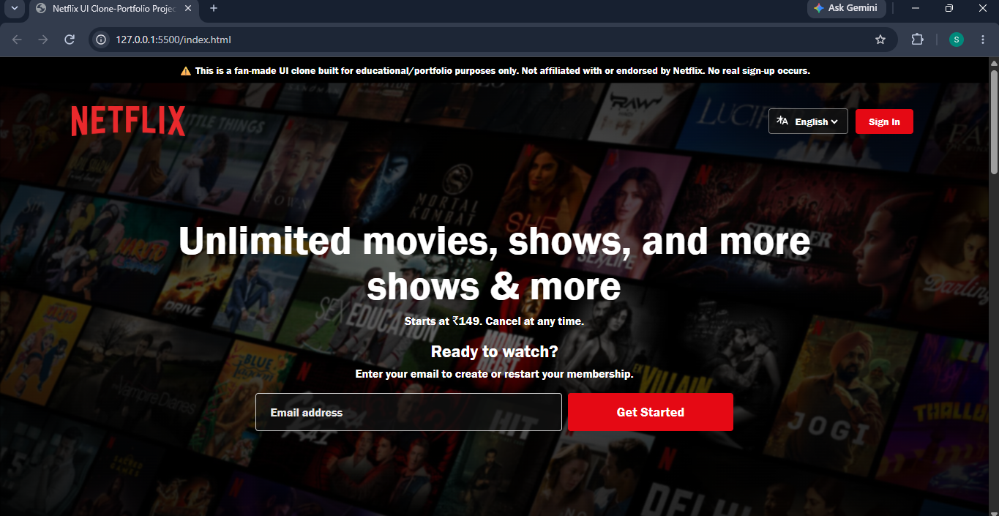
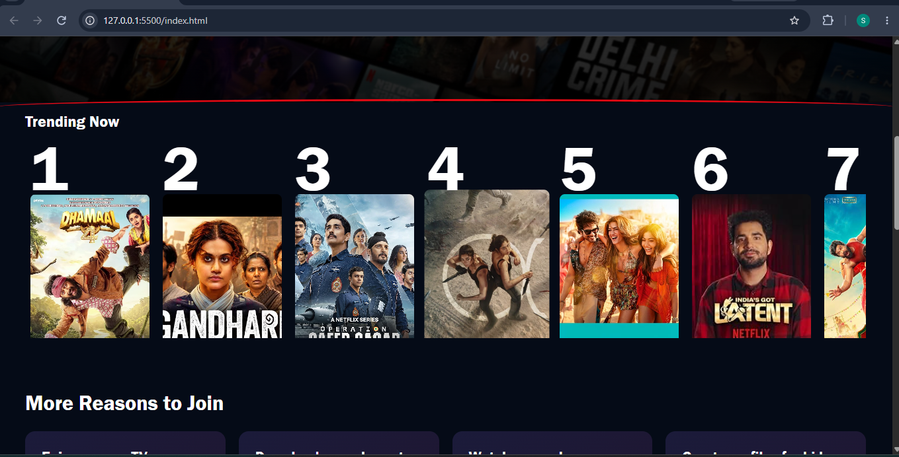
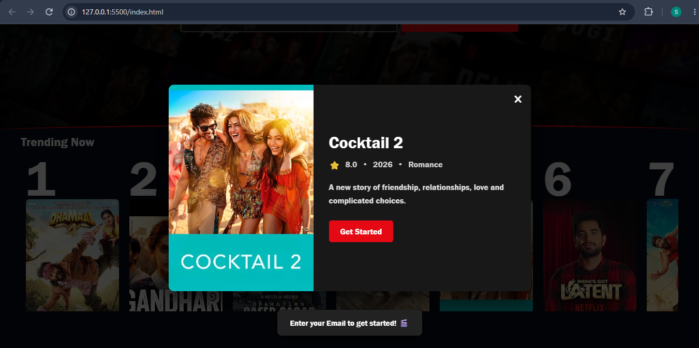
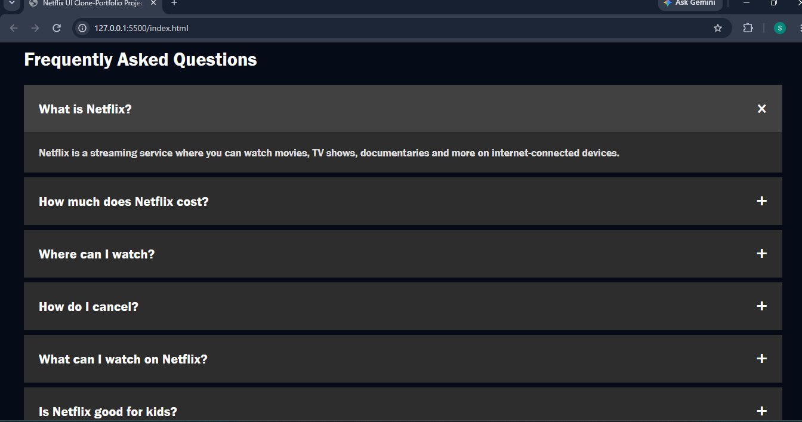

# 🎬 Netflix Clone

A responsive Netflix-inspired front-end web application built using **HTML, CSS, and JavaScript**.

This project was created to practice front-end development, responsive design, JavaScript DOM manipulation, and interactive user experiences.

---

## 📸 Project Preview

### Home Page

### Trending Now

### Movie Details

### FAQ Section

---

## 🎥 Project Demo

I created a short 1-minute video to demonstrate the website and its main features.

[▶️ Watch Project Demo](./screenshots/netflix-clone-demo.mp4)

---

## ✨ Features

- 🎬 Netflix-inspired landing page
- 📱 Responsive design for different screen sizes
- 🔥 Trending Now section with horizontally scrollable movie cards
- 🎥 Interactive movie details modal
- ❌ Modal can be closed using the close button, outside click, or Escape key
- 💾 Uses localStorage for selected movie information
- ❓ Interactive FAQ accordion
- ➕ More Reasons to Join section
- 🔔 Get Started button interaction
- ✨ Hover effects and smooth transitions

---

## 🛠️ Technologies Used

- HTML5
- CSS3
- JavaScript
- Git
- GitHub
- GitHub Pages

---

## 💻 Project Overview

This project recreates the look and feel of a modern Netflix-style landing page.

The website includes a Netflix-style navigation bar, hero section, Trending Now movie section, More Reasons to Join section and FAQ section.

JavaScript is used to make the website interactive. Users can click on movie posters to view their details in a modal, expand and collapse FAQ answers, and interact with the Get Started buttons.

The project is also responsive, so the layout adjusts for different screen sizes.

---

## 📚 What I Learned

While building this project, I practiced:

- Creating responsive web layouts
- HTML and CSS styling
- Flexbox and responsive design
- JavaScript DOM manipulation
- Event handling
- Creating dynamic modals
- Using localStorage
- Creating interactive FAQ sections
- Managing projects using Git and GitHub

---

## 🚀 Future Improvements

- 🔎 Movie search functionality
- ❤️ Watchlist functionality
- 👤 User profiles
- 🔐 User authentication
- 🌐 Movie API integration
- 🗄️ Backend and database integration
- ▶️ Video streaming functionality

---

## ⚠️ Disclaimer

This is a personal educational project inspired by the Netflix user interface.

It is not affiliated with, sponsored by, or officially connected to Netflix.

This project was created for learning and portfolio purposes.

---

## 👩‍💻 About the Project

This project was built as a personal front-end project to strengthen my practical knowledge of **HTML, CSS, and JavaScript** and to understand how interactive and responsive websites are developed.

⭐ Feel free to explore the code and project!
